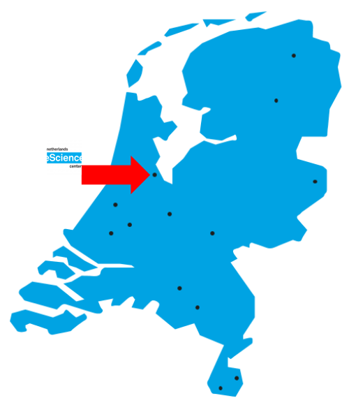

<!-- slide bg="img/escience-cover.png" -->

---

## ¿Quiénes somos?

+ Prof. Lisandra Costiner
+ Historia del Arte
+ Universidad de Utrecht

--

## ¿Quiénes somos?

+ Dr. Pablo Rodríguez
+ Matemáticas aplicadas
+ Netherlands eScience Center

---

### Centro neerlandés de computación científica

---

--

--

--

+ Ingeniería y ciencias físicas
+ Ciencias biosanitarias
+ Ciencias sociales y humanas

---

## Contacto y materiales

[pabrod.github.io/today](https://pabrod.github.io/today.html)